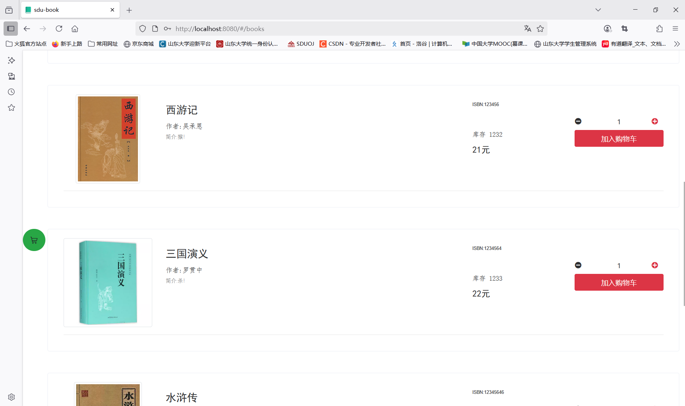

## 快速开始
（1） 下载项目，2-4配置位于 sdu_book_back文件夹中，5-6位于sdu_book_front文件夹中
```
git clone https://github.com/shenshuiqian/sdu_software.git
```
（2）中配置application-dev.yml中的端口号、数据库

```yml
server:
  port: 1211
  address: 0.0.0.0

spring:
  datasource:
    username: root
    password: 123456
    url: jdbc:mysql://localhost:3306/sdu_book?useSSL=false&serverTimezone=Asia/Shanghai&characterEncoding=utf8
    driver-class-name: com.mysql.cj.jdbc.Driver
```


（3）修改WebConfig中的前端照片显示映射

```java
package cn.liantao.lbook.config;

import org.springframework.context.annotation.Configuration;
import org.springframework.web.servlet.config.annotation.ResourceHandlerRegistry;
import org.springframework.web.servlet.config.annotation.WebMvcConfigurer;

@Configuration
public class WebConfig implements WebMvcConfigurer {

    @Override
    public void addResourceHandlers(ResourceHandlerRegistry registry) {
        registry.addResourceHandler("/api/images/**")
                .addResourceLocations("path"); // 本地图片文件夹路径
    }
}
```

（4）借助sql建立相关的数据库

```shell
mysql -u username -p < sdu_book.sql
```

（5）修改前端api中的index.json的默认后端URL

```
const BASE_URL = 'http://192.168.43.197:1211/api'
```

（6）修改前端上传图书封面至后端的路径

```
cover: function () {
                if (Object.keys(this.book).length != 0 && this.book.cover != null) {
                    let cover = "http://192.168.43.197:1211/api/images/"+ this.book.cover
                    return cover
                }
```


### 技术栈：
#####（1）后端使用了Maven 、SpringBoot 、MyBatis 等技术栈

#####（2）前端使用了Vue3、ElementUI、BootStrap、Axios、vuex 、vue-cli等技术栈

#####（3）数据库使用MySQL以及MyBatis

## 功能

* 游客浏览

- 登录登出
- 书籍展示及详情
- 购物车、下单
- 个人订单
- 购买记录

## 管理员功能
- 书籍管理
- 用户封禁
- 订单管理
- 搜索订单
- 订单统计

## 预览图
#### home

#### books


